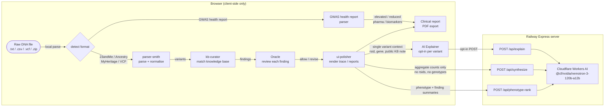
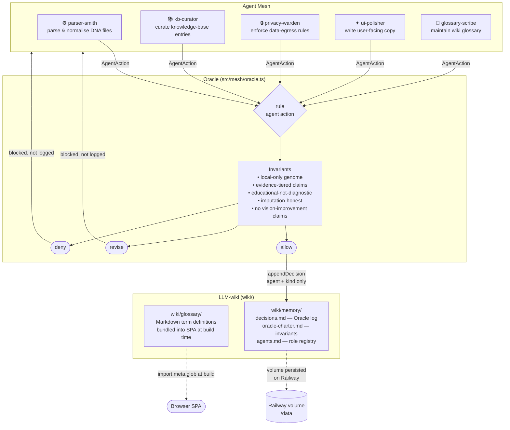

# genome-lens

        

> Local-first personal genomics viewer. Upload a raw DNA export, inspect it, and
> surface evidence-tiered variant associations across health, fitness, body
> composition, and vision — **entirely in your browser**.

**Educational use only. Not medical advice, not a diagnosis.**

---

## What it does

Turn a raw DNA export (23andMe, AncestryDNA, MyHeritage, VCF) or a GWAS health
report into an honest, private, navigable view of what is known and what is not:

- **Parses locally** — your raw DNA file never leaves your device. No upload
  endpoint, no telemetry on genetic data.
- **Five input formats** — 23andMe, AncestryDNA, MyHeritage (including low-pass
  WGS), VCF v4.x clinical sequencing, and structured GWAS health reports.
- **Evidence-tiered** — every variant claim cites a real source (ClinVar,
  GWAS Catalog, PharmGKB, SNPedia…) and a confidence tier (A/B/C). Nothing
  fabricated.
- **Honest about gaps** — flags imputation, low-pass calls, and SNPs that are
  simply absent from your file (not a negative result).
- **2D trace browser** — manhattan overview + per-chromosome linear tracks.
- **3D karyotype** — idiogram bars with centromere constrictions, interactive
  markers, and a detail panel. Rendered with three.js / React Three Fiber.
- **Agent mesh visualization** — animated Canvas 2D pipeline showing data flow
  through parser, KB curator, MCP servers, privacy warden, and Oracle.
- **Four tiered reports** — health/disease, fitness, body composition, vision.
- **Clinical report export** — printable/PDF findings report grouped by category
  with tier chips, caveats, and evidence legend.
- **GWAS health report mode** — imports structured GWAS/multivariate/monovariate
  health reports, surfaces elevated/reduced risk findings, pharmacogenetics,
  biomarkers, and hereditary screening in a condensed PDF-exportable view.
- **Phenotype-driven AI ranking** — describe a symptom or phenotype and rank
  your genetic findings by relevance (server-side AI, opt-in).
- **Glossary & wiki** — plain-language genomics definitions, backed by a Markdown
  LLM-wiki (`wiki/`) that doubles as the agent mesh's memory.
- **Optional AI explainer** — opt-in two-paragraph explanations (what it means +
  how to reduce risk) via Cloudflare Workers AI. Your raw genome file is **never**
  sent; see [Privacy](#privacy).

---

## Quick start

```bash
git clone https://github.com/arananet/genome-lens.git
cd genome-lens
npm install

npm run dev      # start the local dev server (Vite)
npm test         # run the test suite (Vitest)
npm run build    # produce a static SPA in dist/
```

Open the dev URL Vite prints, then drag-drop a raw DNA file (`.txt`, `.csv`,
`.vcf`, or `.zip`). Everything runs client-side.

Synthetic test samples are included in `samples/` for quick testing.

---

## Usage

1. Drag a raw DNA file (23andMe, AncestryDNA, MyHeritage, VCF) or a GWAS health
   report onto the upload pane.
2. genome-lens auto-detects the format, parses it locally, and reports source,
   variant count, build, and whether the method was low-pass.
3. Browse the 2D trace, spin the 3D karyotype, watch the agent mesh animation,
   or open any knowledge-base match to see genotype, tier, sources, and caveats.
4. Read the four tiered reports (health, fitness, body composition, vision).
5. Export a clinical findings report as PDF via **Export report**.
6. For GWAS health reports: view elevated/reduced risk findings, pharmacogenetics,
   biomarkers, and hereditary screening — export as PDF.
7. Hit **Wipe all data** to clear everything from the tab.

---

## Deployment

### Static SPA (Railway)

The app is a static SPA. On Railway it builds with `npm run build` and is served
from `dist/` by [`serve`](https://www.npmjs.com/package/serve). Config lives in
[`railway.json`](railway.json) and [`nixpacks.toml`](nixpacks.toml).

```bash
npm run build
npm run start    # serve dist/ on $PORT (used by Railway)
```

### AI explainer (Cloudflare Worker)

The optional LLM explainer is a separate Cloudflare Worker in
[`worker/`](worker/) that proxies to Cloudflare Workers AI. Deploy it with
Wrangler and point the SPA at it via `VITE_AI_WORKER_URL`. See
[`worker/README.md`](worker/README.md).

---

## Privacy

- Your raw DNA file is parsed in-browser and is **never uploaded**.
- **No persistence** — genome data exists only in browser memory for the duration of the session. There is no login, no user account, and no IndexedDB storage.
- The optional AI explainer sends **only** the single variant context you ask about (rsid, gene, genotype, and the already-public knowledge-base note) — opt-in per request. The raw genome file is never transmitted.
- The optional AI synthesis sends **only** aggregate counts (`parsed N · covered M`) — no rsids, no genotypes.
- A strict Content-Security-Policy forbids outbound connections except to the app's own origin.

---

## Architecture

### Data pipeline (runtime)

Every genome analysis runs entirely in your browser — no upload ever occurs.



**Privacy invariant**: the raw genome file and individual genotypes never leave the browser. The server receives only (a) single-variant public-KB context when you click *Explain* (opt-in), (b) aggregate category counts for *Synthesize*, or (c) finding summaries (rsid, gene, category — no raw genotypes) for *Phenotype Rank*.

---

### Agent mesh, Oracle & LLM-wiki

The **agent mesh** is the development governance layer. It coordinates five specialised agents under a rule-based **Oracle** that enforces non-negotiable invariants. All agent decisions are logged to a Markdown **LLM-wiki** that doubles as shared memory across sessions.



#### Agent roles

| Agent | Role | Key invariant guarded |
|---|---|---|
| `parser-smith` | Parse DNA files, normalise strands | Never modifies raw data |
| `kb-curator` | Curate KB entries with sources | Every claim must cite a real source |
| `privacy-warden` | Gate data-egress actions | No bulk genome upload |
| `ui-polisher` | Write user-facing copy | No diagnostic phrasing, no risk% |
| `glossary-scribe` | Maintain `wiki/glossary/` | Educational tone only |

#### Oracle invariants (enforced on every agent action)

1. **local-only** — no action may transmit the raw genome file
2. **evidence-tiered** — every KB claim must have ≥1 cited source
3. **educational-not-diagnostic** — no diagnostic language or risk percentages
4. **imputation-honest** — low-pass / no-call status must be surfaced
5. **no-vision-improvement** — no claims about improving eyesight

#### What is stored where

| Layer | Data | Persistent? |
|---|---|---|
| Browser memory | Full genome (session only) | No — cleared on page close |
| Browser IndexedDB | Nothing (removed — no user auth) | No |
| Railway volume `/data/wiki/` | Static glossary + Oracle log (agent+kind only) | Yes — no genomic data |
| Railway volume `/data/cache/synth/` | AI synthesis text (no counts, no rsids) | Yes — no genomic data |

---

---

## Contributing

This project uses **OpenSpec** for spec-driven development — every feature or
bugfix starts with a spec under `.openspec/specs/`. See
[`docs/OPENSPEC.md`](docs/OPENSPEC.md) and [`CONTRIBUTING.md`](CONTRIBUTING.md).

---

## Developer

Built by **Eduardo Arana**.

## License

[MIT](LICENSE)

---

[](https://ko-fi.com/H2H51MPWG)
