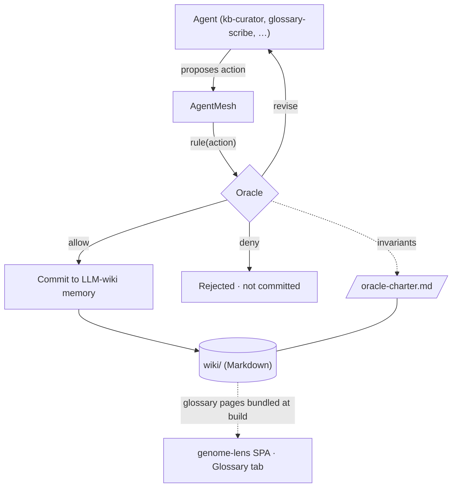

# Agent mesh, Oracle governance & the LLM-wiki

genome-lens ships with a small **agent mesh**: a development/governance harness in
which specialized agents collaborate, share memory through a Markdown **LLM-wiki**,
and are governed by an **Oracle** that enforces the project's non-negotiable
invariants.

> This harness is development tooling. It is **not** bundled into the browser app
> and never processes a user's genome. The genomics app itself remains strictly
> local-first.

## Why

The genome-lens brief has hard constraints — local-only, evidence-tiered,
educational-not-diagnostic, imputation-honest, no vision-improvement claims. The
mesh makes those constraints *executable*: any agent action that would violate one
is denied or sent back for revision **before** it can land.

## Components

- **Oracle** (`src/mesh/oracle.ts`) — the governor. Every action is ruled
  `allow`, `revise`, or `deny` against the invariants in
  [`wiki/memory/oracle-charter.md`](../wiki/memory/oracle-charter.md).
- **Agents** (`wiki/memory/agents.md`) — single-responsibility roles:
  `kb-curator`, `parser-smith`, `glossary-scribe`, `ui-polisher`,
  `privacy-warden`.
- **LLM-wiki** (`wiki/`) — flat Markdown pages, readable by humans and LLMs alike.
  `wiki/glossary/` is bundled into the app's Glossary tab; `wiki/memory/` is the
  mesh's durable memory and append-only decision log.
- **Memory** (`src/mesh/memory.ts`) — reads/writes the wiki pages (Node only).
- **Mesh coordinator** (`src/mesh/mesh.ts`) — submits actions to the Oracle and
  records allowed ones to the decision log.

## Flow



## Invariants the Oracle enforces

1. **Local-only / no genome egress** — block transmitting raw genome or personal
   genotypes off-device; the wiki must never contain genome data.
2. **Educational, not diagnostic** — no diagnoses, no personal risk percentages.
3. **Evidence-tiered, no fabrication** — every KB claim needs ≥1 cited source and
   a tier; no invented statistics.
4. **Imputation honesty** — never present inferred/low-confidence calls as
   measured.
5. **No vision-improvement claims** — the vision surface reports risk + lifestyle
   levers only.

## Using it

```ts
import { AgentMesh } from "./src/mesh";

const mesh = new AgentMesh();
const { ruling, committed } = mesh.submit({
  agent: "kb-curator",
  kind: "kb-entry",
  summary: "Add rs1815739 (ACTN3).",
  payload: { tier: "B", sources: [{ db: "dbSNP", id: "rs1815739", url: "https://…" }] },
});
// ruling.verdict === "allow"; the decision is appended to wiki/memory/decisions.md
```

Behavior is covered by `tests/mesh.test.ts`.
